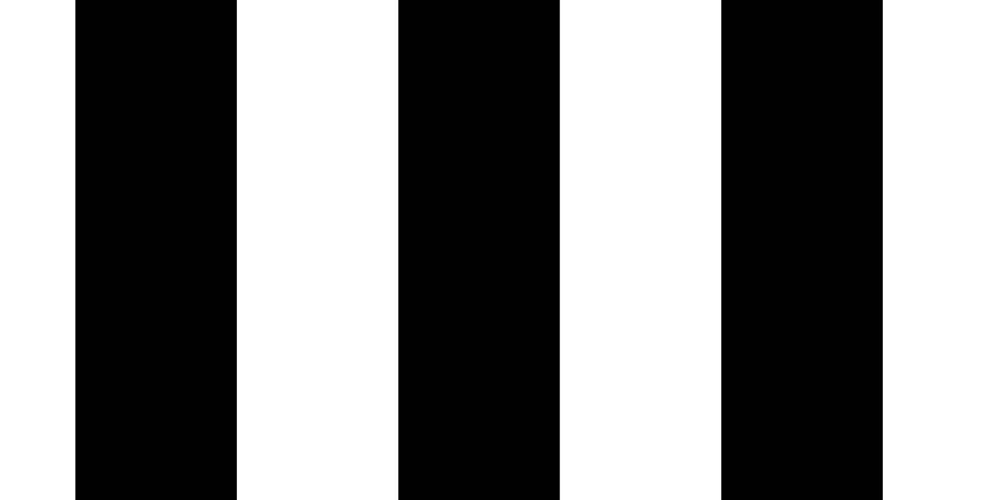
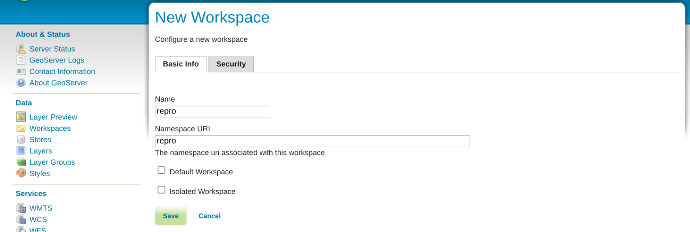
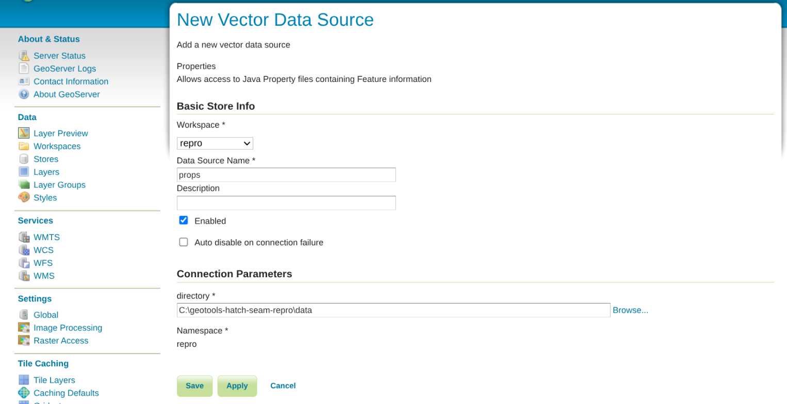
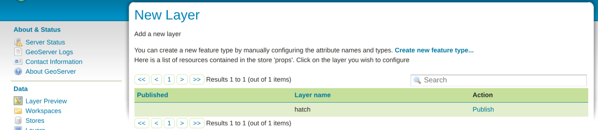
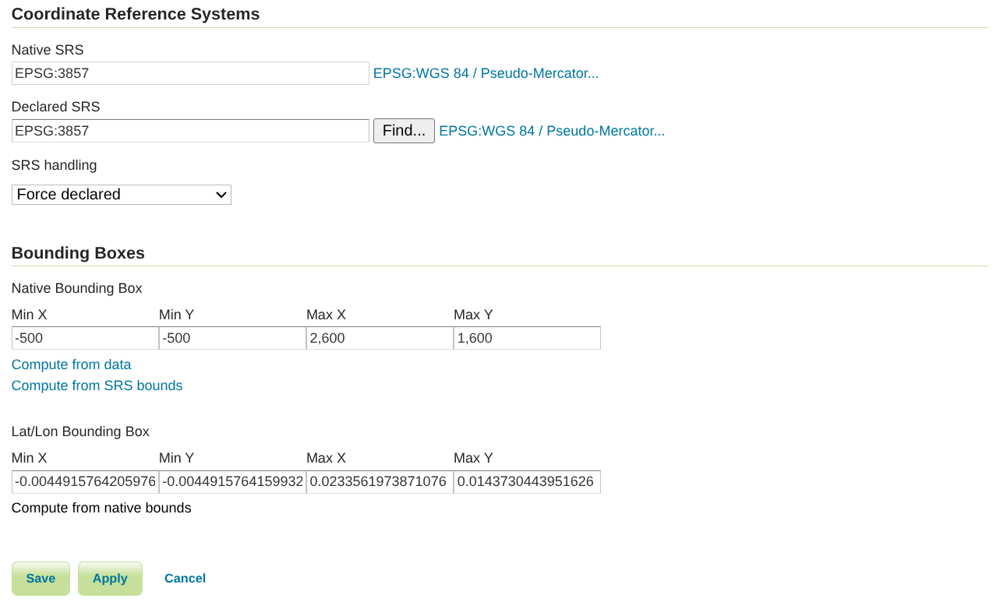
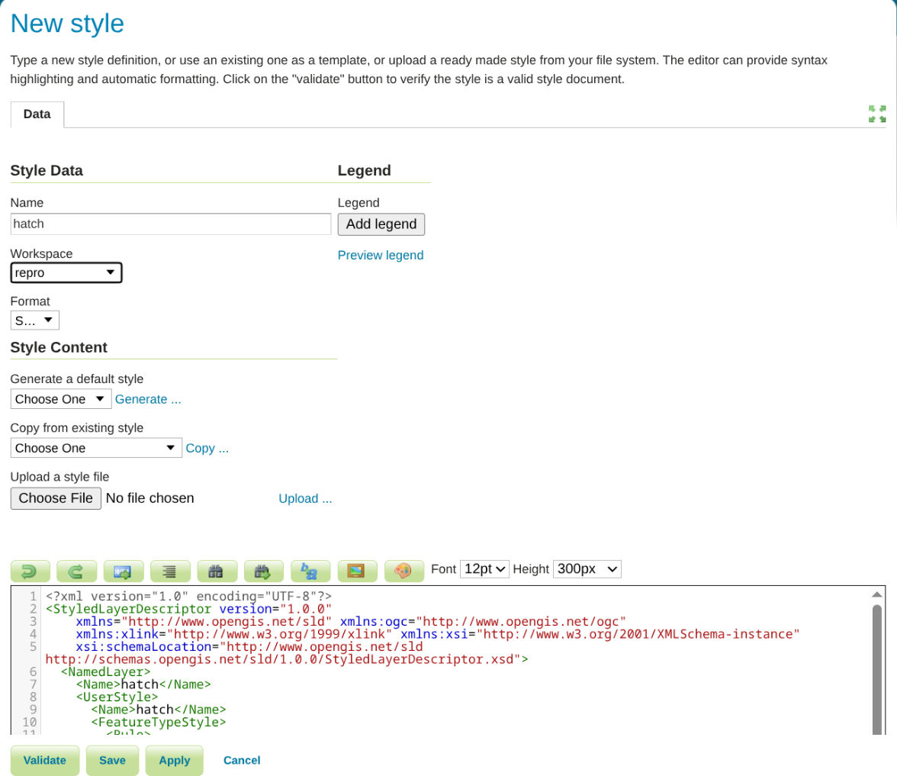
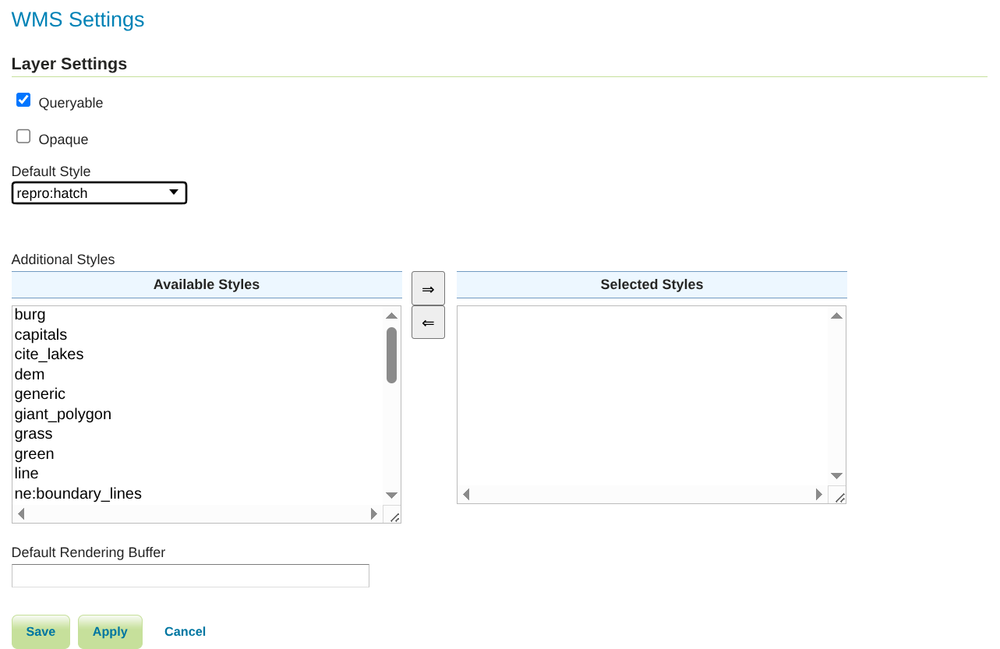

# Hatch fill across WMS tile borders

Minimal setup with a stock GeoServer platform-independent binary. No extensions, no database:
one polygon in a property file, one SLD with a `shape://vertline` graphic fill, six GetMap requests.

## What it does

The same extent is rendered twice: as two adjacent 1024 px tiles, and as one 2048 px image.
Both are done at `format_options=dpi:200` and at `format_options=dpi:300`.

- At 200 dpi the stitched tiles and the single image are byte-identical.
- At 300 dpi the two tiles are byte-identical to each other, and the stitched result differs from
  the single image: the bar that crosses the tile border is cut and the pattern restarts after it.

## Run

Requires Java 17+ on the `PATH`.

Linux or macOS (bash, also needs curl and unzip):

```bash
./repro.sh            # downloads GeoServer 2.28.5, starts it on port 8085, renders, stops it
KEEP=1 ./repro.sh     # leave GeoServer running (admin / geoserver)
```

Windows (PowerShell):

```powershell
powershell -ExecutionPolicy Bypass -File .\repro.ps1                    # same as ./repro.sh
$env:KEEP = "1"; powershell -ExecutionPolicy Bypass -File .\repro.ps1   # leave GeoServer running
```

Outputs in `out/`:

- `tiled_dpi300.png`: two 1024 px tiles side by side, border at x = 1024.
- `untiled_dpi300.png`: the same extent as one 2048 px request.
- `tiled_dpi200.png`, `untiled_dpi200.png`: the same at 200 dpi.

The scripts also print the dark runs along the middle row of each image. Output with GeoServer 2.28.5:

```
tiled_dpi200.png   [110..330]=221 [551..771]=221 [992..1212]=221 [1433..1653]=221 [1874..2047]=174
untiled_dpi200.png [110..330]=221 [551..771]=221 [992..1212]=221 [1433..1653]=221 [1874..2047]=174
tiled_dpi300.png   [154..484]=331 [816..1023]=208 [1178..1508]=331 [1840..2047]=208
untiled_dpi300.png [154..484]=331 [816..1145]=330 [1477..1807]=331
```

## Files

- `data/hatch.properties`: GeoServer property datastore with one polygon (EPSG:3857) larger than both tiles.
- `hatch.sld`: polygon symbolizer with a `shape://vertline` graphic fill, size 200, stroke width 100.
- `Stitch.java`: appends the tiles and prints the bar runs (run with `java Stitch.java`, no build needed).
- `repro.sh`, `repro.ps1`: download, start, configure through the REST API, render, stitch.
- `docs/`: screenshots for the manual setup below.

## Rendered results

Two 1024 px tiles at 300 dpi, border at x = 1024 (`results/tiled_dpi300.png`):


Same extent as one request at 300 dpi (`results/untiled_dpi300.png`):



Same two tiles at 200 dpi (`results/tiled_dpi200.png`):


## Manual setup on an existing GeoServer

Without the scripts, the same configuration can be created in the web UI of any GeoServer running
locally. The URLs below assume `http://localhost:8080/geoserver`; adjust host and port if needed.

1. **Workspace**: *Workspaces* > *Add new workspace*. Name `repro`, Namespace URI `repro`. Save.

   

2. **Store**: *Stores* > *Add new Store* > *Properties*. Workspace `repro`, Data Source Name `props`,
   directory = absolute path of the `data` folder of this repository, e.g.
   `C:\geotools-hatch-seam-repro\data`. Save.

   

3. **Layer**: on the *New Layer* page that opens, click *Publish* next to `hatch`.

   

   On the *Data* tab:
   - Declared SRS `EPSG:3857` (already set from the data)
   - Native Bounding Box: Min X `-500`, Min Y `-500`, Max X `2600`, Max Y `1600`
   - Lat/Lon Bounding Box: *Compute from native bounds*

   Save.

   

4. **Style**: *Styles* > *Add a new style*. Workspace `repro`, format SLD.
   *Upload a style file* > choose `hatch.sld` > *Upload ...*. This loads the SLD into the editor and sets
   the name to `hatch`. Save.

   

5. **Default style**: *Layers* > `hatch` > *Publishing* tab > Default Style `repro:hatch`. Save.

   

Then request the three images at 300 dpi, for example in a browser, and save them into `out/`:

```
tile1_dpi300.png    http://localhost:8080/geoserver/repro/wms?SERVICE=WMS&VERSION=1.1.1&REQUEST=GetMap&LAYERS=repro:hatch&STYLES=&FORMAT=image/png&TRANSPARENT=true&SRS=EPSG:3857&WIDTH=1024&HEIGHT=1024&BBOX=0,0,1024,1024&format_options=dpi:300
tile2_dpi300.png    http://localhost:8080/geoserver/repro/wms?SERVICE=WMS&VERSION=1.1.1&REQUEST=GetMap&LAYERS=repro:hatch&STYLES=&FORMAT=image/png&TRANSPARENT=true&SRS=EPSG:3857&WIDTH=1024&HEIGHT=1024&BBOX=1024,0,2048,1024&format_options=dpi:300
untiled_dpi300.png  http://localhost:8080/geoserver/repro/wms?SERVICE=WMS&VERSION=1.1.1&REQUEST=GetMap&LAYERS=repro:hatch&STYLES=&FORMAT=image/png&TRANSPARENT=true&SRS=EPSG:3857&WIDTH=2048&HEIGHT=1024&BBOX=0,0,2048,1024&format_options=dpi:300
```

For 200 dpi, replace `dpi:300` with `dpi:200`. Stitch the tiles and print the bar runs with:

```
java Stitch.java out/tiled_dpi300.png out/tile1_dpi300.png out/tile2_dpi300.png
java Stitch.java out/untiled_dpi300_check.png out/untiled_dpi300.png
```
